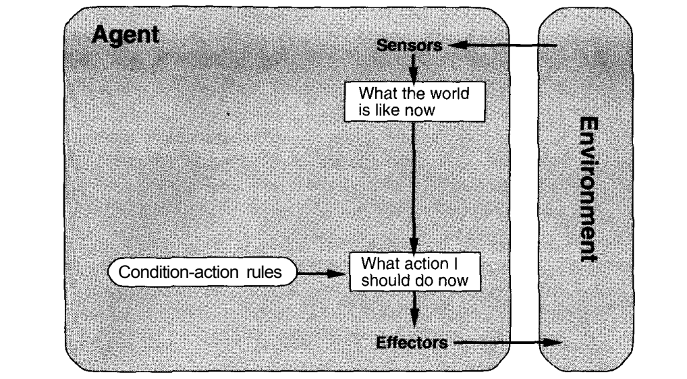
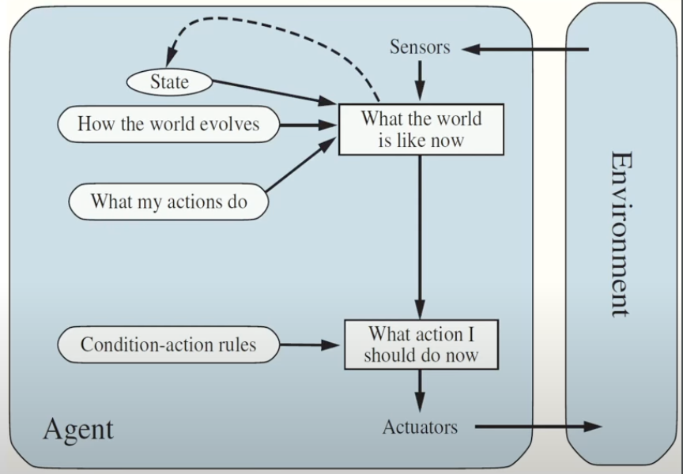
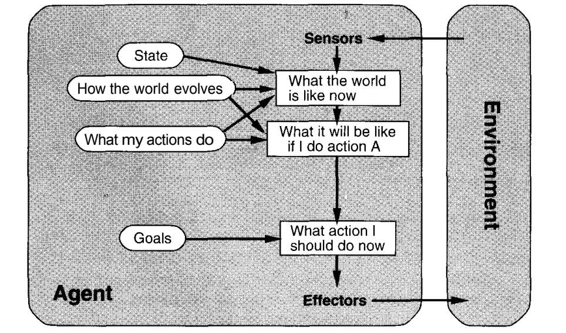
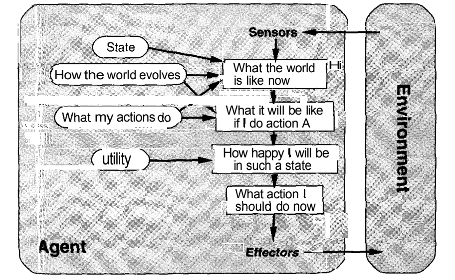

## But what is AI? 

AI is the branch of computer science that focuses on creating machines, systems or programs capable of performing tasks that typically require human intelligence. These tasks include learning, reasoning, problem-solving, understanding language, and perceiving the world.
For example:
- AI systems can play chess, diagnose diseases, understand speech, and even drive cars.

### How to measure computer machine intelligence? 

The **Turing Test** is a test created by British mathematician and computer scientist **Alan Turing** in 1950 to measure whether a machine can exhibit behavior that is indistinguishable from human intelligence.
#### How the Turing Test Works:
1. **Participants:** There are three players:
	- A human **judge**.
	- A **human participant**.
	- A **machine (AI)**.
2. **Setup:**  
	- The judge communicates with both the human and the machine through text (like a chat interface) to avoid being biased by their physical appearance or voice.

3. **Goal:**  
	- The judge asks questions to both the human and the machine and tries to determine which one is the machine.
	- If the judge can’t reliably tell the difference between the human and the machine, the machine is said to have passed the Turing Test.
The Turing Test measures **how human-like AI behavior is**, focusing on the ability to think, respond, and communicate intelligently.

- [This Coursera](https://www.coursera.org/articles/history-of-ai) article provides an insightful overview of the evolution of Artificial Intelligence (AI) throughout history, tracing its development over the years.

### Strong AI Vs Weak AI
- **Strong AI (AGI)**: This is an AI that can think, learn, and understand things just like a human. It can perform any intellectual task a human can do, including reasoning, problem-solving, and emotional understanding.  
    **Example**: A robot that can learn new skills, adapt to different environments, and think like a human.
    
- **Weak AI (Narrow AI)**: This is AI that is designed to do one specific task and does it very well, but it can't think or learn beyond that task.  
    **Example**: ChatGPT, which is great at answering questions but can't think independently like a human. Another example is a voice assistant like Siri or Alexa.

### Categories of AI Systems:

1. **Reactive Machines:**
    
    - These can only react to the present situation. They don’t have memory or learn from the past.
    - Example: A chess-playing computer that only considers current moves but doesn’t remember past games.
2. **Limited Memory:**
    
    - These AI systems can remember past data for a short time and use it to make decisions.
    - Example: Self-driving cars that remember traffic conditions around them.
3. **Theory of Mind (Future AI):**
    
    - These machines would understand emotions, beliefs, and thoughts.
    - Example: A robot understands someone’s sadness and offers comfort (not yet possible).
4. **Self-aware AI (Future AI):**
    
    - The ultimate goal of AI. These machines would not only think but also have their own consciousness and awareness, just like humans.
    - Example: A robot that knows it exists (pure science fiction for now).
### Intelligent Agents:

An **intelligent agent** is anything that can observe its surroundings, take action, and try to reach a goal.  
For example, a cleaning robot is an agent—it senses dirt, moves to clean, and stops when the floor is tidy.

#### Types of Environments:

Agents operate in different kinds of **environments**:

1. **Deterministic vs. Stochastic:**
    
    - Deterministic: Actions always have predictable outcomes.  
        Example: A calculator always gives the same result for the same input.
    - Stochastic: Outcomes are uncertain and can vary.  
        Example: Weather forecasting.
2. **Static vs. Dynamic:**
    
    - Static: The environment doesn’t change while the agent is working.  
        Example: Solving a puzzle.
    - Dynamic: The environment keeps changing.  
        Example: Driving on a busy road.
3. **Discrete vs. Continuous:**
    
    - Discrete: Limited, clear steps or actions.  
        Example: A board game like chess.
    - Continuous: Many possible actions or values.  
        Example: A robot arm moving smoothly to grab something.
#### Types of Agents:

1. **Simple Reflex Agents:**
    - They act based only on what they see now, ignoring the past.
    - These agents work on a continuous loop of perception and action. 
    - Agent perceives the environment with the help of sensors continuously. 
    - Then, the agent checks the condition-action rules and takes an action based on it. 
    - These agents cannot learn from past experience. 
    - Example: A thermostat that turns the heater on or off based on the current temperature.

2. **Model-Based Agents:**
    - These have a memory and can understand how things work in the world.
    - Here, agents first perceive the current state of the environment.
	 - The agent maintains an internal model of the environment, which includes information about the state of the world, possible actions it can take, and the expected outcome of those actions.  
	 - Based on current perceptual input and the state of its internal node the agent makes a decision. 
	 - Then, action is taken and the state of the internal model is also updated. 
    - Example: A self-driving car that remembers traffic lights and road rules.

3. **Goal-Based Agents:**
    - These agents have a specific goal in mind and take action to get there.
    - These agents use planning algorithms. 
    - Example: A robot navigates a maze to find the exit.

4. **Utility-Based Agents:**
    - These agents not only aim to achieve a goal but also choose the **best** way to do it.
    - These agents provide an extra component of performance measurement, this helps them to find the measure of success at a given state. 
    - Example: A delivery drone choosing the fastest and safest route to deliver a package.

-> **Now, it's time to move on to [Assignment 1](./Assignments/Assignment1/). Read the [problem statement here](./Assignments/Assignment1/problem_Statement.md).**
