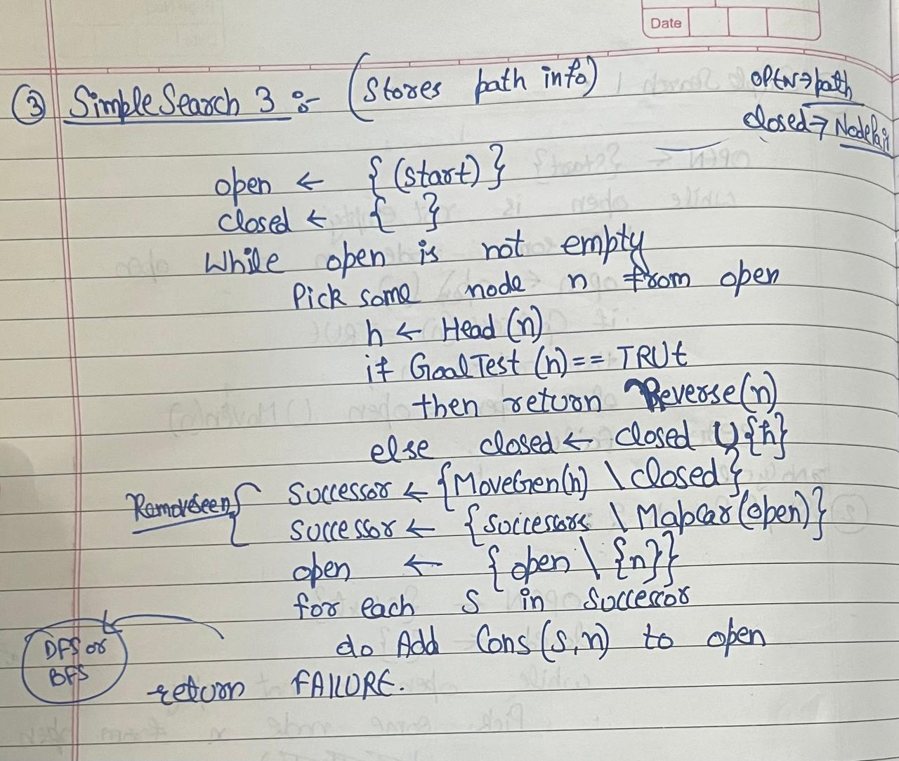
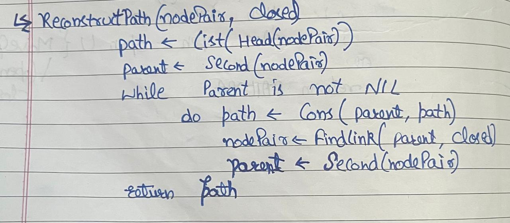

### Table of Contents

*   [Problem-Solving Aspect of AI](#problem-solving-aspect-of-ai)
*   [State Space Search](#state-space-search)
*   [Generate and Test](#generate-and-test)
*   [Algorithms](#algorithms)
    *   [SimpleSearch1](#simplesearch1)
    *   [SimpleSearch2](#simplesearch2)
    *   [SimpleSearch3](#simplesearch3)
*   [Comparison of DFS and BFS](#comparison-of-dfs-and-bfs)
*   [Depth Bounded DFS](#depth-bounded-dfs)
*   [Heuristics](#heuristics)
*   [Best First Search](#best-first-search)
*   [Hill Climbing Problem](#hill-climbing-problem)
*   [Blocks World Problem](#blocks-world-problem)
    *   [First heuristic function](#first-heuristic-function)
    *   [Second heuristic function](#second-heuristic-function)
*   [Next Steps](#next-steps)

# Problem-Solving Aspect of AI

- Agent is a term that is used to refer to problem solver. 
- Problem-solving basically involves doing the right thing at the right time. 
- Given a problem to solve, the task is to select the right moves that would lead to the solution.
- This is one of the core goals of AI and involves mimicking human reasoning and decision-making processes.
		$Initial State \xrightarrow{\text{Decisions}} Destination State$ 
The task is to find these decision. 
- To move from an **initial state** to a **destination state**, decisions must be made about the steps or actions to take. There are two primary approaches to making these decisions:

1. **Search-Based Methods**:
    - These involve exploring possible solutions systematically, like searching through a graph or tree.
    - Example techniques: **Breadth-First Search (BFS)**, **Depth-First Search (DFS)**, **A***, **Best-First Search**.
    - They rely on algorithms rather than prior knowledge and can be computationally intensive.
2. **Knowledge-Based Methods**:
    - These use domain-specific knowledge or heuristics to guide decisions efficiently.
    - Example: Rule-based systems, expert systems, or AI models that rely on learned patterns.
    - They are faster but depend on having relevant knowledge or experience in the domain.

## State Space Search 
- State Space represents the problem domain in which a solution is to be found.

- **Components**:
    - **States**: Specific configurations of the problem at any point.
    - **Initial State**: The starting point of the problem.
    - **Goal State(s)**: The desired state(s) that solve the problem.
    - **Operators/Actions**: Actions that move the system from one state to another.
- State Space Search is the process of finding a sequence of actions (or path) from the initial state to a goal state by exploring the state space.

- **Techniques**:
	- **Uninformed Search**: No prior knowledge about the goal, e.g., Breadth-First Search, Depth-First Search.
	- **Informed Search**: Uses a heuristic to estimate the cost to reach the goal, e.g., Best-First Search, A*, Greedy Search.
In all of these algorithms, we will be following Generate and Test Approach: 
### **Generate and Test**
- **Definition**: A simple problem-solving approach that generates possible solutions and tests each to determine if it is the goal.
- **Steps**:
    1. **Generate**: Create a possible solution (state) using some mechanism.
    2. **Test**: Check if the generated state meets the goal criteria (using the goal test).
    3. If not, repeat until a solution is found or all possibilities are exhausted.
- **Example**: In a maze-solving problem, generate all possible moves from a position and test if any lead to the exit.
-> There are 2 key functions in Generate and Test approach 
1. **MoveGen (Move Generator)**:
    - Generates all possible successor states from the current state based on the allowed actions/operators.
    - Example: In a chess game, it generates all legal moves for a given position.

2. **GoalTest**:
    - A function to check if a given state satisfies the goal condition.
    - Example: In a puzzle, it checks if the tiles are arranged in the desired configuration.

- The nodes visited by the Search Algorithm form a graph.

### Algorithms:

## SimpleSearch1: 
- Assume a big data structure called OPEN(list) to store the candidates that we have generated. 
```
SimpleSearch1()
open = {start}
while open is not empty:
  pick some node n from open
  open = open \ {n}

  if Goaltest(n) is TRUE:
    return n // Or the path to n
  else:
    open = open U MoveGen(n)

return FAILURE
```

There are a few limitations with this algorithm:- 
- The algorithm does not track visited nodes. If the graph contains cycles, it could result in infinite loops or redundant exploration of the same nodes.
- Also, this algorithm will add states that are already present in OPEN again to the OPEN list. 

### SimpleSearch2
- Here, we follow the same approach as SimpleSearch1 by maintaining a list of seen nodes. This list of seen nodes is called CLOSED. 
- It contains the list of states we have tested, and should not visit again. Also, we don't want states, that are already on OPEN. 
```
SimpleSearch2()
open = {start}
closed = {}

while open is not empty:
  pick some node n from open
  open = open \ {n}  // Remove n from open
  closed = closed U {n} // Add n to closed

  if Goaltest(n) is TRUE:
    return n // Or the path to n
  else:
    open = open U (MoveGen(n) \ closed) // Add new nodes, excluding those already closed

return FAILURE
```

Example: 


### SimpleSearch3
- SS2 algo returns the goal state when it finds it. Such problems where only goal matters are known as configuration problems. 
- There are a few problems in which the path to goal also matters, such problems are called planning problems. 
- SS3 Algorithm is for planning problems
- After picking the node from OPEN, it extracts the current state h. It tests h with goalTest and generates its successors using moveGen. When the goal node is found, all that the algorithm needs to do is to reverse the node to get the path in the proper order. 
- The function `mapcar` takes a list of lists as an argument and returns a list containing the heads of the input lists. The function cons adds a new element to the head of a list.

- Example:

- In SS-3, OPEN contains paths and CLOSED contains states. Next, we can modify our search function such that both OPEN and CLOSED store node pairs, representing a node and its parent node in the search tree.
- Now, all nodes in the search tree have the same structure.  
- We will, however, need to do more work to return the path found. Each node visited has a back pointer to its parent node. The algorithm reconstructPath below reconstructs the path by tracing these back pointers until it reaches the start node which has NIL as the back pointer.




-> The question arises of picking some node n from open and putting a new node in open. 
- For picking a node from open always pick the head node. 
- Appending a new node to open could be done in 2 ways, either append the new node at the head(DFS) or append the new node at the tail(BFS). 


Both of these algorithms are blind. That is uninformed. They do a random search. 
### Comparison of **DFS** and **BFS**:

- **Time Complexity**:
    - **DFS**: O($b^m$)(where b is the branching factor, m is the maximum depth).
    - **BFS**: O($b^n$) (where b is the branching factor, d is the depth of the shallowest solution).
- **Space Complexity**:
    - **DFS**: O(b⋅m). Linear space
    - **BFS**: O($b^n$) (because BFS stores all nodes at the current depth level).
- **Completeness**:
    - **DFS**: Not complete in infinite or cyclic graphs.
    - **BFS**: Complete (finds a solution if one exists).
- **Quality of Solution**:
    - **DFS**: May not find the optimal solution.
    - **BFS**: Always finds the optimal solution (in unweighted graphs).

Now, we want an algorithm that is combination of shortest path(BFS) and linear space(DFS). 
### Depth Bounded DFS
Here, we put a depth bound. 
Example: Don't go more than 20 steps or some other depth bound. 
This algorithm is of linear space(because DFS) but not complete. 
### Depth Bounded DFS
- Also known as the iterative deepening algorithm. 

In every cycle, the depth bound is increased by 1 and then DFS is performed. 
- Linear Space because every time we are doing DFS with different bounds. 
- Quality -> Finds the shortest path always. 

## Heuristics 
- If we try to solve the Rubix cube using the DFID algorithm, it would take around $10^{10} years$. 
- We can't just explore randomly because it will take us a long time to find a solution(exponential time complexity). 
- In Heuristic Search we use the knowledge of Goal state as well. 
- h(n) ->  Heuristic function gives us a value that will tell how easy it is to go from the current state to the goal state. 
- After appending a new node to open, when we pick a new node from open we will first sort the nodes present in open by their heuristic value. 
- This heuristic value will tell us how easy it is to go from the current state to the goal state. 
$OPEN\leftarrow sort_h(append(new, Tail(OPEN)))$ 
- We can shorten this since we are doing sorting again and again:- 
$OPEN\leftarrow Merge(sort_h(new),Tail(OPEN))$
- This is because the open is already sorted. This decreases the time complexity of this operation.
We can also keep OPEN as a priority queue. Priority is based on heuristic value. 
- Structure of NodePair $\rightarrow(current, parent, h)$
- The heuristic function could be calculated differently in different problems. 
- It could be **Euclidean distance** or **Manhattan distance** in a city map problem. 
- It could be calculated in some other way in other problems. 
### Best First Search 
- Here, the open list is the list of all global states. We sort the list based on heuristics and choose the next node. This next node could be anywhere in the graph, not necessarily in the most downward node.  

Properties of Best First Search
- It is complete. Always gives the solution. 
- It may lead to longer solutions not always the shortest. 
- Time complexity -> depends upon the heuristic function. 
- Space complexity -> If the heuristic function is accurate then the search will home in onto the goal directly, and the frontier will only grow linearly. Otherwise, the search algorithm may go down some path, change its mind, and sprout another branch in the search tree. Empirically, it has been found though that for most interesting problems, it is difficult to devise accurate heuristic functions, and consequently, the search frontier also grows exponentially in best first searches.

The search frontier is an indication of the space required. 

- Now, we want an algorithm that takes less space. 
### Hill Climbing Problem 
- Here, say you are blindfolded and you are standing on a slope and asked to reach the top. 

- Here, we use Steppest Gradient Descent. 
- Modify Open from $OPEN\leftarrow Merge(sort_h(new),Tail(OPEN))$ to 
  $OPEN\leftarrow sort_h(new)$ 
- Algo:- 
while next is better than current: 
	do next $\rightarrow$  Best(MoveGen(current))
- Unlike Best First Search, which maintained a global list of candidates. This algorithm does a local search.
- But, Best FS has time and space issues but hill climbing doesn't have that. 
-> Properties: 
- Hill Climbing is not complete
- Quality -> not sure
- Space -> constant
- time -> linear in ideal cases
But, this algorithm faces the problem of local maxima. 


### Blocks World Problem

**Problem Description:**
Imagine a table with several blocks of the same size. The goal is to rearrange these blocks from an initial configuration to a desired goal configuration. A robot arm can move the blocks but with certain restrictions:
- **Only one block can be moved at a time.** The robot arm can only pick up and move one block.
- **A block can only be moved if there are no blocks on top of it.** If a block has another block on it, you must first move the top block before you can move the one below it.
- **A block can be placed either on the table or on top of another block.**

MoveGen on this:- 

#### First heuristic function:- 
- The first function $h_1(n)$ simply checks whether each block is on the correct block, with respect to the final configuration. We add one for every block that is on the block it is supposed to be on, and subtract one for every one that is on athewrong one. 
- The value of the goal node will be 6.
- Observe that the heuristic function is not an estimate of the distance to the goal, but a measure of how much of the goal has been achieved.
- With such a function we are looking for higher values of the heuristic function. That is, the algorithm is performing steepest gradient ascent.
- For the five states, S (start) and its successors P, Q, R, and T, the values are

Choice from state Q:- 

Again, calculate the heuristic function for all states:- 

The heuristic values of the possible moves are given above. Search is at node Q, and all choices have a lower heuristic value. Thus, Q is a local maximum, and Hill Climbing terminates.

#### Second heuristic function
- The second heuristic function $h_2$ looks at the entire pile that the block is resting on. If the configuration of the pile is correct, with respect to the goal, it adds one for every block in the pile, or else it subtracts one for every block in that pile. The values for the six nodes we have seen are

This heuristic function thinks moving to P is the better idea. 
choices from P:- 

Again, calculate the heuristic function for all states:- 

- The search has a better option available in state X and moves to it.
- In the next MoveGen step from X, we will reach the GoalState. 


Hence,  $h_1$ got stuck in local maxima, and $h_2$ gave global maxima. This shows how the choice of heuristic function greatly impacts the solution.

### Next Steps:- 
- Refer to [Assignment2](./Assignments/Assignment2/)
