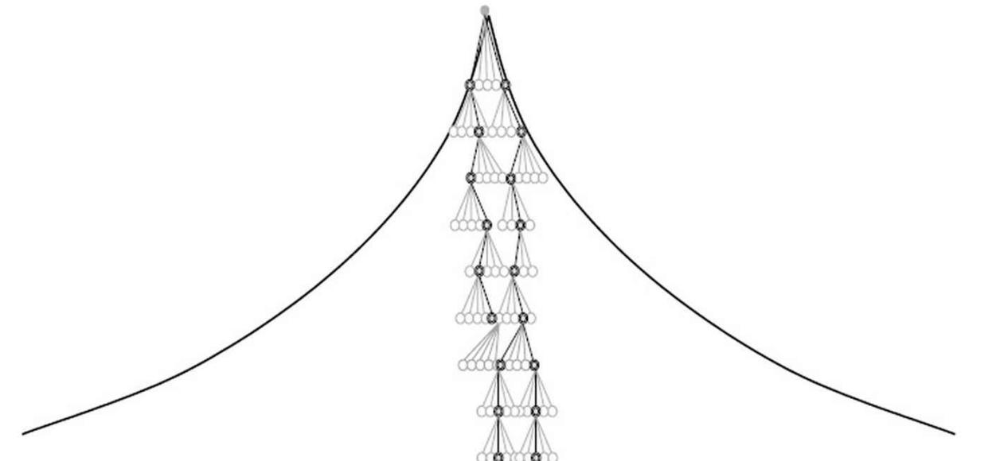
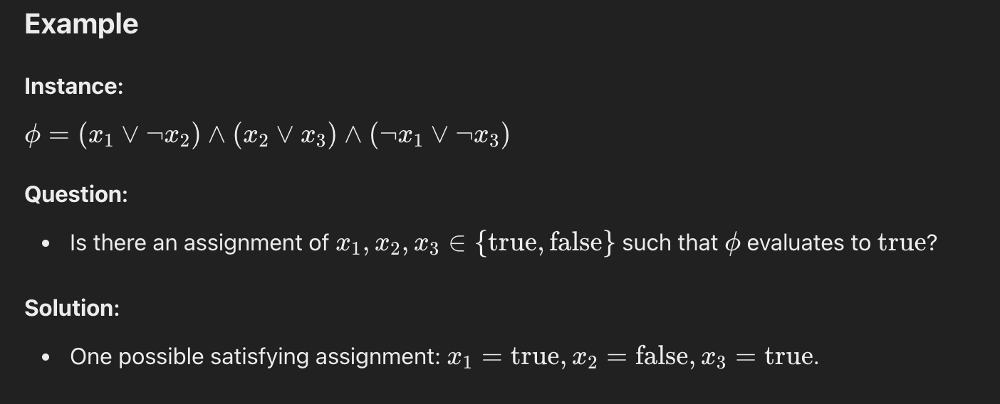
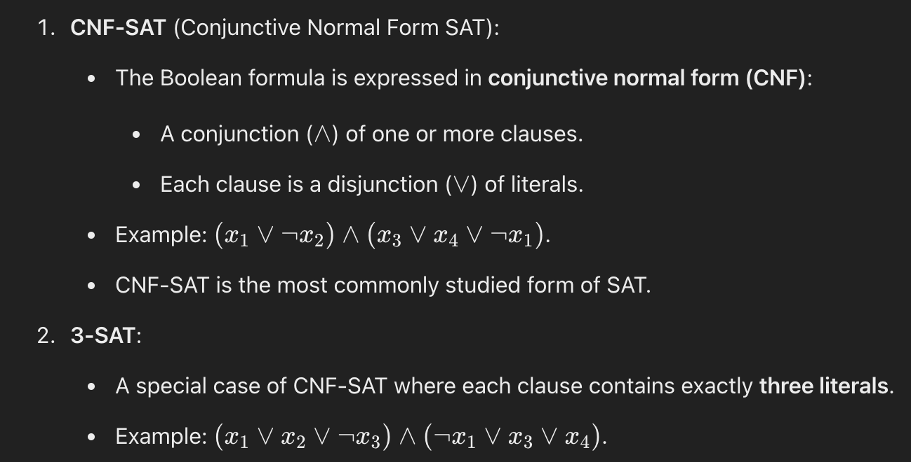
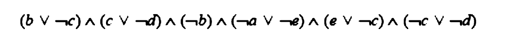
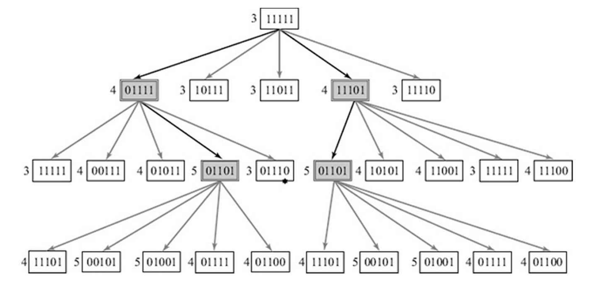
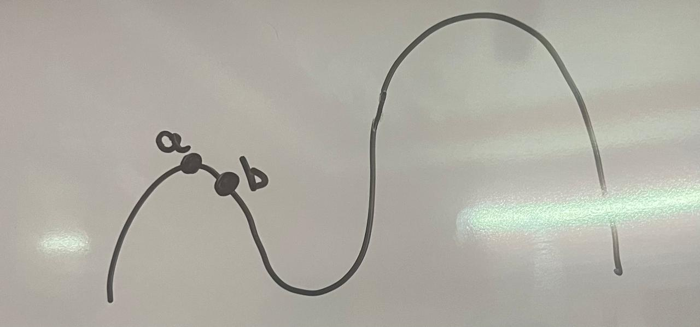
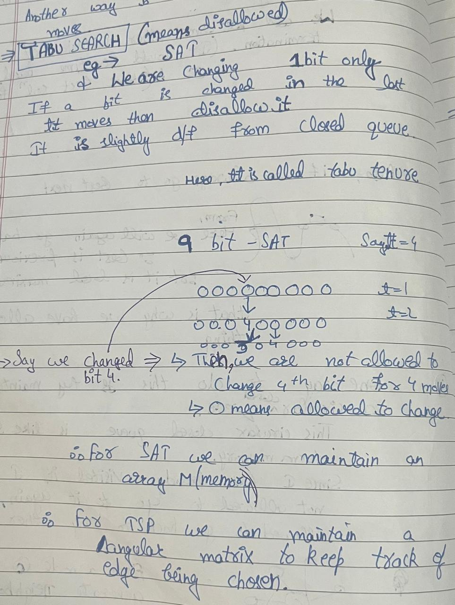
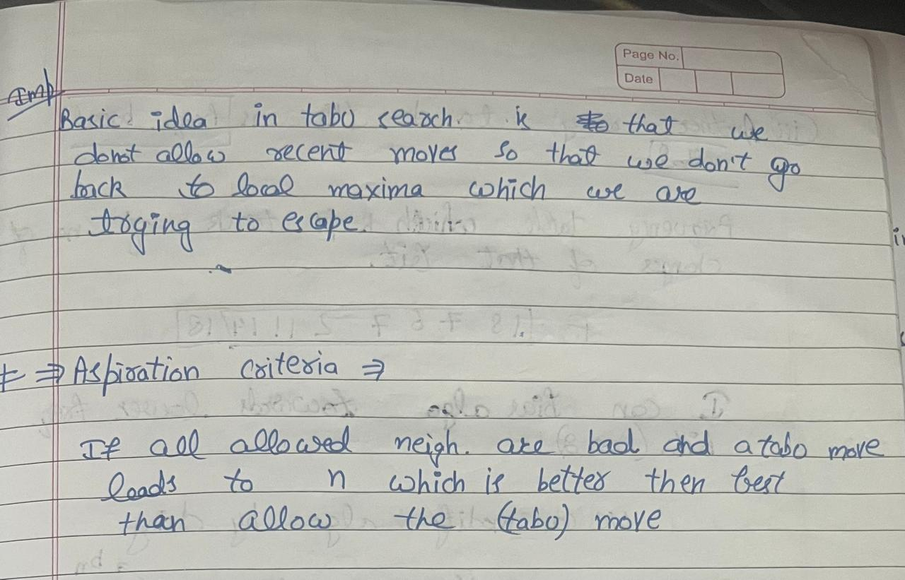

### Table of Contents

*   [The Problem of Local Optima](#the-problem-of-local-optima)
*   [Beam Search](#beam-search)
*   [Solution Space Search](#solution-space-search)
    *   [Introduction to the SAT Problem](#problem-description)
* [Variable Neighborhood Descent](#variable-neighbourhood-descent)
*   [Exploration](#exploration)
    *   [Variations of Hill Climbing](#variations-of-hill-climbing)
    *   [Tabu Search](#tabu-search)
*   [Randomized Methods](#randomized-methods)
*   [Next Steps](#next-steps)
* [References](#references)

# The problem of Local Optima
The Hill Climbing algorithm faces the problem of local optima because, in Hill Climbing, instead of considering global states, we only consider states that give a high heuristic value.
```
while next is better than current: 
	do next = Best(MoveGen(current))
```

- The heuristic function(and the moveGen function) determines the terrain that the algorithm is navigating. 
- In order to have a smooth terrain, we need a good heuristic function. 
## Beam Search
- In many problems, good heuristic functions can be derived but they are not foolproof. 
- Beam Search is an extension of hill climbing. It tries to solve the problem of local optima. 
- Typically, at various levels, a few choices may look almost equal, and the heuristic function may not be able to discriminate between them. In such a situation, it may help to keep more than one node in the search tree at each level. The number of nodes kept is known as the **beam width** b. At each stage of expansion, all b nodes are expanded; and from the successors, the best b are retained. The memory requirement thus increases by a constant amount.
- Search tree for beam width 2:-


### Solution Space Search 
Let's first understand the SAT problem. The **Satisfiability (SAT) Problem** is a classic problem in computer science and mathematical logic. It is a decision problem that asks whether there exists an assignment of truth values (true or false) to variables that satisfies a given Boolean formula.
#### **Problem Description**

1. **Input**:
    - A Boolean formula $\phi$ consisting of:
        - **Variables** (x1,x2,…,$x_n$​) that can take truth values true or false. 
        - **Logical connectives**, such as AND, OR, NOT. 
        - **Parentheses** to structure the formula.
2. **Goal**:
    - Determine if there exists a **truth assignment** (i.e., assigning true of false values to each variable) such that the entire formula evaluates to true. 
3. **Output**:
    - "Yes" if a satisfying truth assignment exists, and "No" otherwise.


We will consider 3-SAT problem and understand the solution space search. 

-> Here, instead of starting from a start state and then moving towards the goal, we begin with a candidate solution. We check if this candidate solution satisfies the problem. If it does not, we apply a different neighborhood function to the candidate solution to produce a new candidate solution and keep doing this. 

- Example of a candidate solution and neighbourhood function in a 3-SAT problem:-

For this problem let's choose the starting candidate string as 11111. one bit for the truth value of each variable. 
- heuristic function - 1 for true and 0 for false. Add all. 
- moveGen function - Change any one bit. 
-> Now, let's apply beam search on this. 

here, we move towards the maximum heuristic value with beam width=2
- We didn't get the answer. But instead of starting with 11111, if we had started with 01110. We would have reached the goal. 
Hence, if we try starting with different possible values... we will reach the goal. 
### Variable Neighbourhood descent. 
Consider 5 neighbourhood functions
1. N1 -> change any one bit -> gives 5 neighbours
2. N2 -> Change any 2 bits.  -> gives nC2 neighbours
3. N3 -> Change any 3 bits. 
4. N4 -> Change any 4 bits. 
5. N5 -> Change all the bits.

As we move from N1 to N5 we are increasing the number of neighbours that is we are exploring more. Hence chances of finding a solution is very high. 

Start with N1 if a solution not found... move to N2 and so on. 
- N1 -> Sparse neighbourhood fn 
- N5 -> Dense neighbourhood fn

In variable neighbourhood descent, we go from sparse neighbourhood fn to dense neighbourhood fn. 

Therefore, if we get stuck in local maxima, we will try a denser neighbourhood function and keep doing it until we get the most optimal state. 

- Therefore, the idea is to start with a simple function and then increase the density of functions. 
### Exploration 
- Escaping local optima requires the ability to explore. 
- Hill climbing does exploitation(follows the gradient). 

This is because, In hill climbing, we move until the next is better than the current. So it might happen that we reach a local maximum and the next is not better than the current so we stop. 

How to explore more so that we are not stuck in local optima?

#### Variations of Hill climbing:- 
```
while some termination criteria: 
	next = Best(Allowed(MoveGen(current)))
```
So, we always move to the best neighbour. That is this next neighbour doesn't have to be better than current state. 
- We will keep track of best solution found till now and after termination that will be our answer. 
- The termination criteria could be time-based or something else. 

- If we move towards the best next state without considering the current state. Then, it might happen that from "a" say, we go to "b"(next best). Then, from "b" next best is again "a". How to prevent b from going back to a?
- This can be done by maintaing a circular queue. This circular queue is like short-term memory. Since our algorithm has already visited a, we are not allowed to go back to a for some time.
- Another way to keep track of recent moves is:- 
#### Tabu Search 


- Another to keep track of recent moves is by frequency table. 

Till now, we discussed deterministic ways to solve the problem of local maxima. 
Let's try to solve this problem by using stochastic or randomized methods:- 
## Randomized methods:- 
Here, the goal is exploration. 
- In the random walk algorithm, we move towards a random neighbour from the current state. But, this is uninformed. 
Hill Climbing is an extreme of exploitation. 
Random Walk is an extreme of exploration. 
We want something in between. 
- Simulated annealing is an algorithm that gives a solution to this. Then, there are a few population-based methods as well to introduce the best mix of exploration and exploitation. 
- This is totally optional but if you want to learn more about these randomized algorithm to solve the problem of local optima, you can refer to [this pdf](./Extra_Learning/randomizedMethods.pdf).

## Next Steps:- 
It's time to do another assignment. 
[Link](./Assignments/Assignment3)

## References 
- Artificial Intelligence: A Modern Approach by Stuart J. Russell and Peter Norvig
- A First Course in Artificial Intelligence by Deepak Khemani