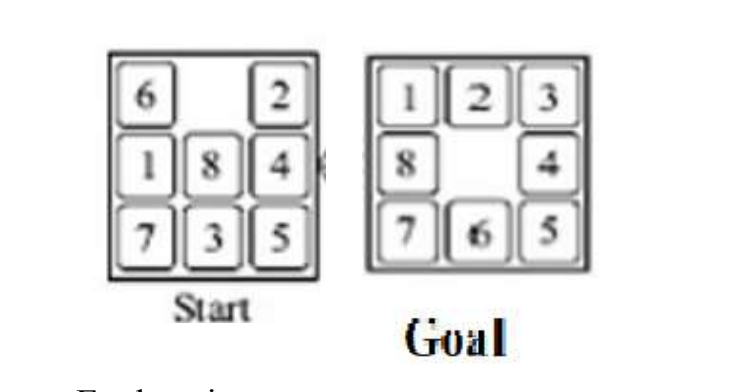

# The 8-Puzzle Problem

The 8-puzzle problem is a classic sliding puzzle that consists of a 3x3 grid containing eight numbered tiles and one blank space. The tiles are labeled with the numbers 1 through 8, and the blank space is used to slide the tiles to rearrange them. The objective is to transform a given initial configuration of tiles into a goal configuration by sliding tiles into the blank space, following specific rules.

Note: For an 8-puzzle problem to have a solution, the parity of the number of inversions must match the goal state.

### Operators (Actions):

The tiles adjacent to the blank space can be moved into it, effectively "sliding" them. The four possible moves are:
- Up: Slide the tile above the blank space into it.
- Down: Slide the tile below the blank space into it.
- Left: Slide the tile to the left of the blank space into it.
- Right: Slide the tile to the right of the blank space into it. 

## **Assignment Description:**

Write the domain functions for the Eight Puzzle Problem. Devise two heuristic
functions h1 and h2. Implement the Best First Search algorithm with the two
heuristic functions. Randomly generate few start states and goal states and run the
algorithm with two heuristic functions. Compute and compare effective branching
factor for the two versions. Also compare the performance with uninformed search
methods i.e. Breadth First Search and Depth First Search.

Example Start and Goal State:- 

### Explanation

Follow the steps given below.

1) Representation of the Domain:
Decide the data structure used to represent the Eight Puzzle Problem. For
example we can represent it with a matrix, each cell can hold values from 1
to 9 and blank tile may be represented by 0 or ‘B’.
2) MoveGen Function:
Write function for generating moves in all directions of the blank tile.
3) Implement a function to randomly generate Start and Goal States.
4) Write functions for finding invalid states.
5) Write heuristic functions h1 and h2. The function using h1 heuristics
computes the heuristic value by counting number of misplaced tiles between
current state and goal state. Function using h2 computes Manhattan distance
between current state and goal state.
6) Implement Best First Search algorithm with h1 and h2 as heuristics.

7) Compare the algorithm with uninformed search BFS and DFS by finding the
number of nodes generated and number of moves required to reach goal
state.
8) Run the Best First Search Algorithm for 100 start and goal states and
evaluate performance using the two heuristics by computing the Effective
Branching Factor.
9) Visualize performance of all algorithms. 

### Best First Search Algorithm:

It is a heuristic based algorithm. Starts with the start state. Next step is to generate
neighboring states by MoveGen function, computing heuristic value for each node generated and adding to Open (data structure for storing nodes). Sort the nodes on heuristic value and choose node with maximum(minimum) heuristic value. Best node chosen is tested if it is Goal Node and then its neighbors are generated. The
search continues till goal node is found or till Open is empty.

I have provided the solution [here](./main.cpp), but try to solve the assignment yourself first. 

- To compile the file run `make main`
- Then execute the file `./main`
- Generate plot of different algorithms run, `python3 main.py`