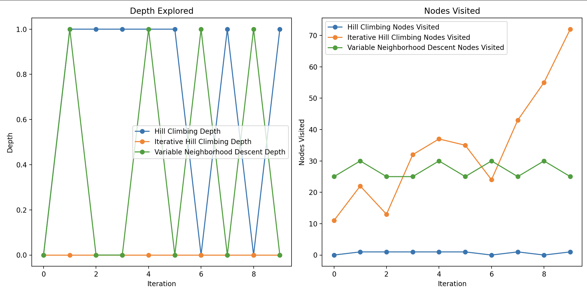

## Assignment 
Write programs to solve a set of Uniform Random 3-SAT problems for different
combinations of m and n and compare their performance. Try the 
- Hill Climbing
algorithm,
- Iterative Hill Climbing
- Variable Neighborhood Descent 

### Explanation of these algorithms
1. Hill Climbing Algorithm:
- What it does:  It starts with a random solution and repeatedly moves to a neighboring solution that is better (has more clauses satisfied). The algorithm keeps making these moves until no better solution can be found.
- How it works: A random solution (a binary assignment for variables) is chosen.
The algorithm then generates neighboring solutions by flipping one variable at a time.
It evaluates these neighbors and chooses the one with the most satisfied clauses.
This process continues until no neighboring solution has more satisfied clauses than the current one.
- What we learn from this: This is a basic greedy algorithm that always looks for the immediate best move, but it may get stuck in local maxima (solutions that are better than their neighbors but not the best overall solution).

2. Iterative Hill Climbing Algorithm:

- What it does: This is a variation of the Hill Climbing algorithm where the process of Hill Climbing is repeated multiple times to improve the solution.
- How it works:
The Hill Climbing algorithm is run multiple times (in this case, 100 times).
For each run, the algorithm finds a solution by making moves to neighbors.
At the end of all runs, the best solution found across all iterations is chosen.
- What we learn from this: By repeating the Hill Climbing process, the algorithm can potentially explore a larger solution space and find better solutions than just one run. But it still may get stuck in local maxima in each individual run.
3. Variable Neighborhood Descent (VND) Algorithm:

- What it does: This algorithm is a more advanced search method that explores different sizes of neighborhoods, making the search more flexible and less likely to get stuck in a local maximum.
- How it works:
Like Hill Climbing, it starts with a random solution.
However, instead of just flipping one bit at a time, VND explores neighborhoods of different sizes (1-bit, 2-bit, or 3-bit flips).
After trying all neighborhood sizes, it moves to the best solution found.
If this new solution is better, the algorithm continues the search with that solution.
The process repeats until no better solution is found after exploring all neighborhoods.
- What we learn from this: VND is more flexible because it considers different types of moves (small and large changes), which helps avoid getting stuck in local maxima. It explores a wider search space by varying the size of the neighborhood.

Try to do this assignment yourself first. 

You can refer to [this](./main.py) for solution.
- Run the `main.py` file by writing this command on your terminal:- 
```shell
python3 main.py
```

At the end the plot generated will look something like this:- 

