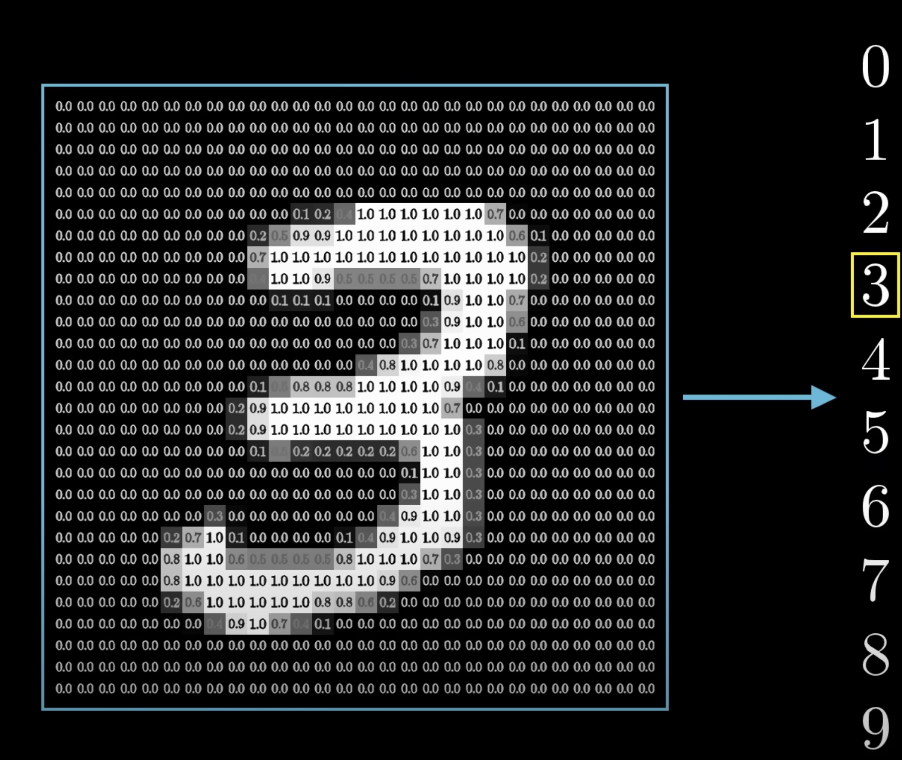
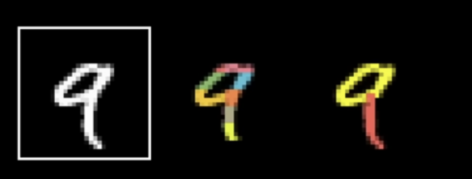

### Let's take an example of a program that takes in a 28 * 28 pixels greyscale image and gives output as the number in that image.

- Neural networks are inspired by the brain.
Let's undertand the representation first:-

1. Neuron: A basic unit of a neural network that holds a number between 0 and 1, known as its activation.
2. Input Layer: The network begins with neurons that correspond to the input data. For a 28x28 grayscale image, there are 784 neurons (one for each pixel).
3. Pixel Value Representation: Each neuron holds a value between 0 and 1:
   - 0 represents black.
   - 1 represents white.
   - Intermediate values represent shades of gray.

These 784(28x28) neurons of the input layer make up the first layer of our network.

- The last layer has 10 neurons each representing a digit from 0 to 10.([0,10))

- The activation in these neurons represents how much the system thinks the digit in the image corresponds to this number.

- The layers in between are called the hidden layers.

- These layers tells how to recognize the digit from the image.
- In this case, there are 2 hidden layers with 16 neurons each.
 **Activation in one layer operates the activation in the next layer.**
#### What are the middle layers doing?
- Each neuron in the second-last layer corresponds to sub-components:-

- so certain neurons are activated depending upon the subcomponents of the digit and thus going from the third layer to the last layer just requires knowing which combination of the sub-components will give the required digit. 

- recognizing a sub-component can also be broken down into determining the small parts of it like edges.

- Therefore the second layer might be determining the subcomponent through edges. That is each neuron in the second layer corresponds to an edge.
 

#### How does an activation in one layer determine the activation in the other layer?

- Let's consider one particular neuron in the second layer to pick up whether or not the image has an edge in a region or not.

##### What parameters should the network have?
 
- Assign a **weight**(randome number) to each one of the connections between second layer's neuron and the neuron from the first layer.

 - These weights are just numbers.(initially randomly initialized)
 - Now, take each of those activation from the first layer and find their weighted sum with the chosen neuron from second layer.

- If you made the weights associated with almost all of the weights zero except for some positive weights in the region we care about, then taking the weighted sum of all the pixel values really just amounts to adding up the values of the pixels just in the region we care about.
- If we want to know whether there is an edge or not, we can have some negative weights associated with the surrounding pixels; then, the sum is largest when those middle pixels are bright, but the surrounding pixels are darker.

- this weighted sum gives any number but we want our activation to have some value between 0 and 1.
- pass this weighted sum through some function that squishes it between 0 and 1.
- A common function that does this is the **sigmoid** function.

- hence the activation of this neuron is how positive the relevant weighted sum is.
- But, we don't want the neuron to light up when the weighted sum is just greater than 0, we want to activate it when the weighted sum is greater than 10.(we want some minimum value)
- That is want some **bias** for it to be inactive.
- just subtract the weighted sum from 10 before passing it to the sigmoid function.

- So the weights tell what pixel pattern this neuron is picking up on and the bias tells how high the weighted sum needs to be before the neurons start getting meaningfully active.
- That is just one neuron, every neuron in this layer will be connected to 784 neurons of the first layer. And each one of those 784 connections has its own weight associated with it and each has its own bias.
- there are 16 neurons and each is associated with 784 weights and each neuron has 1 bias therefore 16 bias in total. These are just connections between the first layer and the second.
- Total number of parameters of our neural network is as shown in the image below:-

- In order to do faster computation let's **vectorize** them as shown in the below image:-

- It is more accurate to think of each neuron as a function that takes in the output of all the neurons of the previous layer and gives output between 0 and 1.
- The entire network is a function that takes in 784 neurons as an input and gives 10 numbers as an output.
- New neural networks don't use sigmoid anymore, they use ReLU(a)=max(0, a)
   It stands for Rectified Linear Unit.

## How the neural networks learn

- Now, we want an algorithm that will take input from training data with labels(correct answers) and will adjust the weights and biases so to improve the performance.

### Loss function
- Initially, the weights and biases are randomly initialised.
- At the start, the output will be very wrong.
- If we feed in an image of 3, the output will be utter trash.
- So, we define a loss function which tells the computer that the output is very bad and how much bad it is.
- Mathematically, we will find mean square error i.e., add up the square of the differences between each of the trash output and the value we want them to have.

`Loss = [(y_true-y_pred)^2]`

This 3.37 is known as the loss of a single training example.
- This sum is small when the network detects the digit correctly but big when it is wrong.

- Then, we consider the average cost over the training set and this average cost determines how bad the computer is. This average cost is given by cost function which aggregates the loss function. 

`Cost = (1 / n) * Σ[(y_true_i - y_pred_i)^2]`

- The cost function takes in the input of those weights and biases and gives a single number as an output. It is determined by various training sets.
- We also want to tell the computer how to change those weights and biases so that it gives better results.
- Instead of thinking about a function that takes in input of so many weights and biases think of a function that takes in the input of one number and gives one number as an output.
- Now, we want to find an input that minimizes the value of this function. We cannot just find a derivative and equate it to zero because the function has so many local minima. It is a complex function.

- So, we do start at any input and figure out which direction you should step to make that output lower.
- Therefore, find the slope, if the slope is positive go left by a small step otherwise right.

- If we do this repeatedly, each time checking the slope and taking an appropriate step, we will reach a local minimum.
- There are many possible values that u might land in, depending upon the random input you start in:-

- Make your step size proportional to the slope so there is no overshooting.

##### Now imagine a function with two inputs and one output:-

- think of the input space as the x-y plane and the cost function being graphed on the surface above it.

Instead of asking about the slope of the function, ask in which direction to step in the input space to decrease the output most quickly.
- The **gradient of a function** gives the direction of the steepest increase, that is which direction to step to increase the function most quickly.
- hence the negative of that gradient gives u the direction that decreases the function most quickly. 
- The length of the gradient is an indication of just how steep the slope is.
- Hence the algorithm to minimize the cost function is to compute the gradient direction and take a small step downhill in the negative gradient direction and just repeat that over and over.
- The same is the case with the main cost function which has many weights and biases as the input.
- We can organize all the weights and biases into a large column vector, the negative gradient of the cost function is just a vector with some direction inside the huge input space, which tells where the best decrease in function is.

- The algorithm for computing this gradient efficiently is called Backpropagation.
- By learning, we mean minimizing the cost function.
- **This process of repeatedly nudging an input of a function by some multiple of the negative gradient is called gradient descent.**
- It's a way to go towards the local minima of a function.
- Each component of the negative gradient tells us two things, the sign tells us whether the corresponding components should be nudged up or down and the magnitude of these components tell us which changes matter the most.

- Adjustments to some weights might have a big impact than an adjustment to the other weight. 
- the gradient vector gives the relative importance of each weight and bias, that is which change will be more impactful.
- the gradient tells what nudges to these weights and biases cause the fastest change in the value of the cost function, that is which change to which change matters the most.
- So we initialized our network with random weights and biases and adjusted it many times based on the gradient descent process.
- This what we did is not bad, it classifies about 96% of the new images correctly. we can increase it to 98%

## Backpropagation
- We are looking for the negative gradient of this cost function which tells us how we need to change the weights and biases so as to most efficiently decrease the cost.
- BackPropagation is an algorithm to compute that complicated gradient.
- Thinking of gradient as a direction in 13k dimensions is difficult.
- So, think of it like this, the magnitude of each component here is telling you how sensitive the cost function is to each weight and bias. 

- Suppose for an edge, we get the gradient as 3.2 while the gradient for the other edge comes out to be 0.1, then we will interpret it as the cost of the function is 32 times more sensitive to changes in that first weight then the changes in the second weight.

### Intuitive walkthrough

- let's focus on one single example of 2. 

##### What effect does this training example have on how the weights and biases get adjusted?
- We are at a point where the network is not well trained yet so the output is just random.

here the output is just random, we want 1 for 2 and 0 for the rest.
- we can't directly change the activation because we have an influence on the weights and biases only, but it's helpful to keep track of what adjustments will lead to the desired output layer.
- we want the activation of 2 to nudge up and the activation of the rest all to nudge down.
- we want the sizes of these nudges to be proportional to how far away these nudges' values are from the target value.
- In another sense, an increase in the activation of the number 2 neuron is more important than a decrease in the activation of the number 8 neuron.
-  let's focus on the number 2 neuron whose activation we wish to increase.

This activation is defined as the weighted sum and the bias and then applying the sigmoid function to it.
- hence there are three different ways to increase the activation.
 1.  Increase the bias
 2. Increase the weight
 3. Change the activation from the previous layer.
- Let's focus on how the weights should be adjusted.
- weights have differing levels of influence. The connection with the brightest neuron in the preceding layer has the biggest effect since those weights are multiplied by a larger activation value.
- So, if we increase one of those weights it would have a stronger influence on the cost function than increasing the weights of connections with dimmer neurons.
- when we talk about gradient descent we don't only care about whether each component should get up or down we also care about how much effect they produce.
-> we can also increase the activation of 2 neurons by changing the activation of the neurons in the previous layer.
- if everything connected to digit 2 neurons with a positive weight got brighter, and if everything connected with a negative weight got dimmer, then that digit 2 neuron will become more active.
- we cannot directly influence that activation we can only change the weights and biases.
- We also want all of the neurons in the last layer to be less active.  Each of these neurons have their own thought about what should happen to that second to last layer.
- So, the desire of the digit 2 neurons is added together with the desires of all the other output neurons that what should happen from the second to the last layer, again in proportion to the corresponding weights and in proportion to how much each of these neurons needs to change.

From this, we get the idea of backward propagation.
- By adding together all the desired effects we get a list of nudges that u want to happen from the second to the last layer.
- Once we have those nudges, we can recursively apply the same process to the relevant weights and biases to determine those values, repeating the same process backward through the network. 
- This is just a single training example that wishes to nudge each one of those biases.
- Now, we will go through the same backpropagation routine for every other training example, recording how each one of them will change the weights and biases.

- Then u average together those desired changes.
- This collection here of the average nudges of the weights and bias is the negative gradient of the cost function.
- In practice, it takes a computer an extremely long time to add up the influence of every single training example and every single gradient descent step.
- So, instead, we do this, we randomly shuffle the training data and divide them into mini-batches, let's say each one has a 100 training example.

- Now, compute a step according to the mini-batch, it's not the actual gradient of the cost function, which depends on all the training data, it depends on the tiny subset.

- This is not the most efficient step downhill but each mini-batch does you a pretty good approximation and more importantly it gives a significant increase in the computational speed.
- This technique is known as stochastic gradient descent.
- To sum up, backpropagation is an algorithm for determining how a single training example would like to nudge the weights and biases not just in terms of whether they should go up or down, but in terms of what relative proportions to those changes cause the most rapid decrease to the cost.
- A true gradient descent step involves doing this for all training examples and averaging the desired changes u get but that is slow so instead we randomly subdivide the data into mini badges and compute each step with respect to a mini-batch. Repeatedly going through all of the mini-batches and making these adjustments, u will converge a local minimum of the cost function.

## Backpropagation calculus:-

- Consider a network in which each layer has a single neuron in it.
- This particular network is determined by a single neuron and a single bias.
- our goal is to determine how sensitive the cost function is to these terms, that way we know which adjustment to those terms is gonna cause the most efficient decrease in the cost function.
- We are only going to consider the connection between the last two neurons.

- Let the activation of this last neuron be `a superscript L`, indicating which layer it is in, so activation in the previous neuron is as shown:-

- let the true value we want this last activation to be for a given training example be y.(y might be 0 or 1)
- So, the cost of this network with a single training example is:-

- Also, this last activation is determined by a weight, bias, and the previous activation and then passes through a special function known as the sigmoid function.
- let's name this activation `z`.

- `a^(L-1)` is influenced by its own weight and bias, but let's not focus on it for now.
- Now, we want to see how sensitive our cost function is to small changes in weight. In other words:-

- nudge to `w(L)` causes some nudge to `z(L)` which in turn causes some nudge to `a(L)` which directly influences the cost(chain rule of derivative).

- This is a chain rule where multiplying everything on the right gives us a small change in cost function with a small nudge in weight.

- the amount that the small nudge to the weight influences the last layer depends on how strong the previous neuron is.

- all of this is the derivative with respect to `w(l)` for the cost of a specific single training example. 
- the full cost function involves averaging together all those cost across many training examples.

- this is just one component of the gradient vector which is built up of all the derivatives of the cost function with weights and biases.

- sensitivity to biases is almost the same.

- Also, this is where the idea of propagating backward comes from.

- Now, we will keep iterating the same chain rule idea backward, to see how sensitive the cost function is to previous weights.

### Layers with additional neurons

- Now, when additional neurons are added, it's also going to have a subscript, indicating which neuron of the network it is.
- let's use `k` to index the `layer(L-1)` neurons and `j` to index the layer`(L)` neurons.

- since now the weights are also so many, so let's call the weight of the edge connecting this `kth` neuron to the `jth` neuron `w^(L) subscript (jk)`.

- the chain rule derivative expression describing how sensitive the cost is to a specific weight looks essentially the same.

- only derivative of the cost with respect to activation in the previous layer changes. This is because the neuron in the second last layer influences multiple neurons in the last layer.

---
---

Now that you understand the theory behind how neural networks work, explore this [MNIST example](./codes/mnist.ipynb) to see its practical implementation.

## References
- [3Blue1Brown](https://www.youtube.com/watch?v=aircAruvnKk&list=PLZHQObOWTQDNU6R1_67000Dx_ZCJB-3pi&ab_channel=3Blue1Brown)
