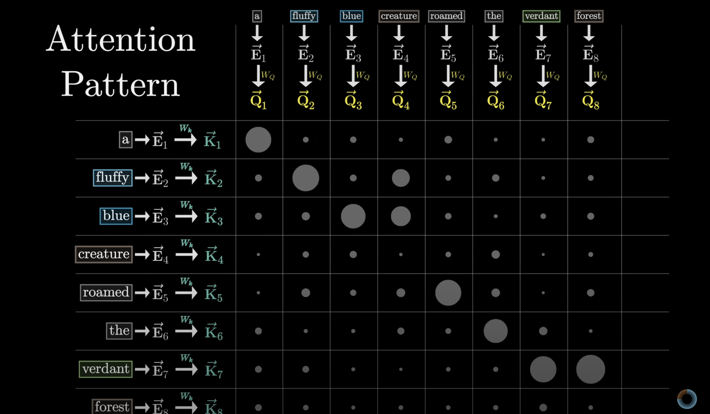
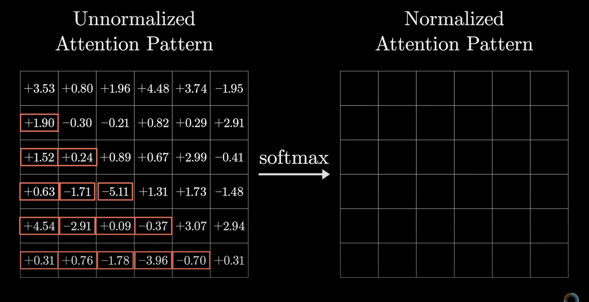
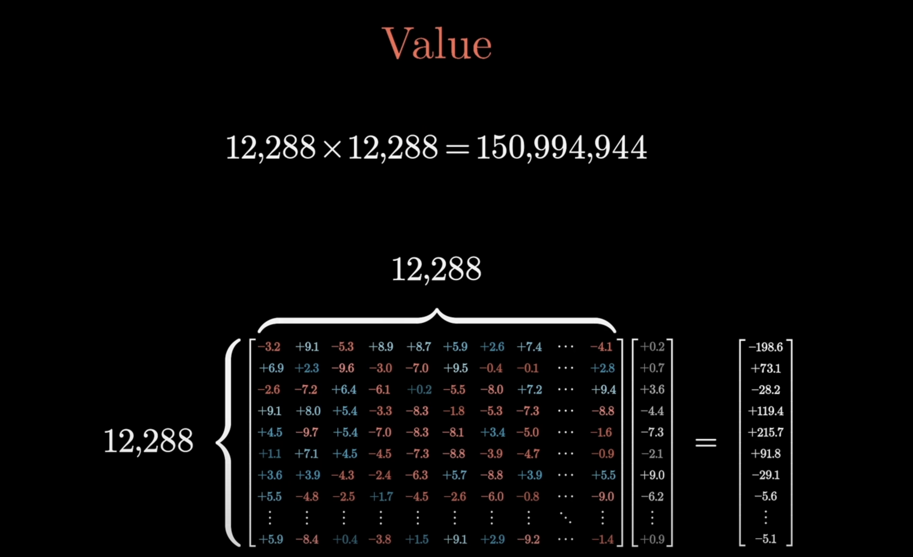
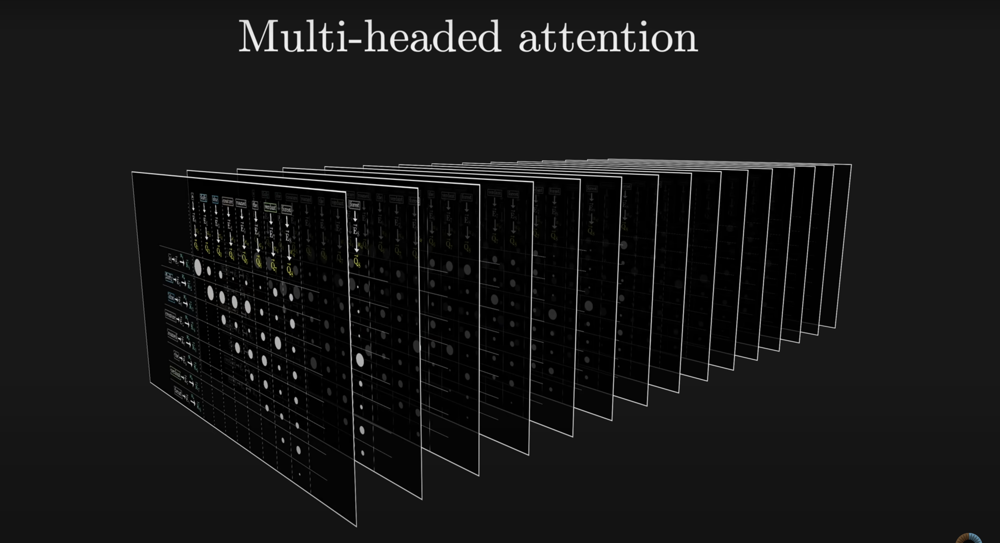
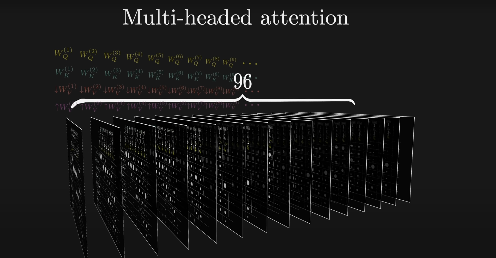
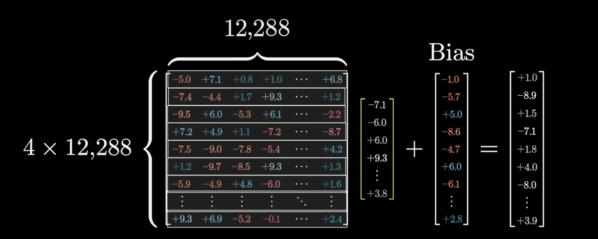
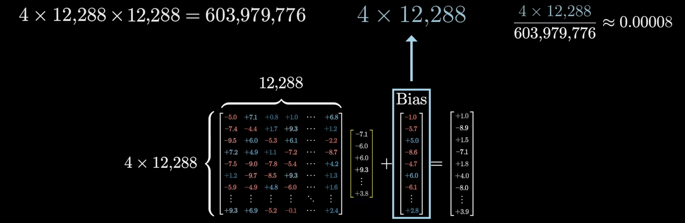

# LLMs for curious beginners

Think of Large Language Models(LLMs) as a machine that can take in any input sentence and predict what word would come next. 

LLM is a sophisticated mathematical function that predicts what word comes next for any piece of text. 
- Instead of just predicting one word, it assigns probabilities to all possible next words. 

---
---
-> For a chatbot, we first lay out some text that describes an interaction between a user and a hypothetical AI assistant. Then, we add-on whatever user types as the first part of that interaction. Then, we let the model repeatedly predict the next word that a hypothetical AI assistant would say in response. 

- In order to make the output look more natural we will allow it to choose less likely words sometimes at random. 
- This means a given prompt will give a different answer each time it runs. 
---
---
Models learn how to make this prediction based on an enormous amount of text fed into them during training. This data is typically pulled from the internet. 

- You can think of training as tuning the dials of a big machine. There are many such dials, which are tuned. These dials are called parameters/weights. Changing the parameters would change the probabilities of the next word. 

- Large in LLMs represents that there are hundreds of billions of these parameters. These parameters are randomly initialized.  Then, they are repeatedly refined based on many example pieces of text. 
- During training, we pass all but the last word to the model and then compare the prediction of the model and the true last word. Then, the backpropagation algorithm is used to tweak the parameters in such a way that it is more likely that the model will choose the true last word and less likely that it will choose other words. 
- We do this many times and then the model learns to give the true last word not only for training data but also for unseen data. 
- The scale of computations involved in training llms is huge. These computations is only possible because of GPUs. 

- This whole process is called pretraining
---
---
- The goal of auto-completing a text is d/f from being a good AI assistant. 
- Chatbots undergo another type of training called Reinforcement Learning with Human Feedback(RLHF). 
- Here, humans flag unhelpful or problematic predictions and their corrections further change the model parameters. This makes models give predictions more likely that users will prefer. 
--- 
- Prior to 2017, most LMs processed texts one word at a time. In 2017, transformer architecture was invented. This made processing texts parallely possible. Transformers don't read text from start to finish, they soak in text all at once in parallel. 

-> The first step in Transformer and other current language models is to associate each word with a long list of numbers. These numbers for a word are known as word embedding of that number. These word embeddings are learned so that they encode the meaning of a word in the best possible way. 

- There is a very special operation in transformers known as Attention. Using this operation the list of word representations in numbers can talk to one another. This helps word representation to refine the meaning they hold based on the context of the sentence. 
- Then, there is another operation known as the Feedforward Neural Network, which allows the model to store more patterns. 

- There are many iterations of these 2 operations. 

- At the end, one final fn is performed at the last vector known as the softmax function. This vector is influenced by all the words in the input. 

 Now, we know what different steps there are in an LLM. Now, let's see the specific behavior that is there inside an LLM. 

## **GPT**
 - GPT is a Generative Pre-trained Transformer
 G -> These are bots that generate new text. 
 P -> Model parameters are learned from a massive data
 T -> Specific kind of neural network that is the core of the current boom in AI.  
  - There are many d/f kinds of models that we can build using transformers like voice-to-text, text-to-voice, and text-to-image, machine translation(the very first transformer invented by Google was used for this task). 
-> **We will focus on a model that takes in some input of text(or audio or image) and produces what comes next in the passage.**
 -> Once we have this prediction model then we can make a loop and generate text non-stop. 

- This process of repeated prediction and sampling is what happens inside Chat-GPT or other LLMs. 
#### Let's see how data flows through a transformer
- At first, the input is broken down into tokens. Tokens are just a small chunk of that input. 

Each one of these tokens is then associated with a vector meaning some list of numbers that is meant to encode the meaning of that word. 

- If you think of these vectors as some coordinates in some very high dimensional space, then words having similar meanings will lie closer in the space than words that have no similarity among them. 
This sequence of vectors is then passed through an operation which is known as an Attention block. 
This allows the vectors to talk to each other and update their values. 

For example: Here the word model has two different meanings based on the words which are used with it. The attention block is responsible for figuring out which words in the sentence are relevant for updating the meaning of other words and how exactly those meanings should be updated. 
After this, the vectors are passed through another operation, the multilayer perceptron or feedforward layer.  

 Here all the vectors go through the same operation in parallel. 
 
 - The MLP layer is basically like asking a long list of questions on each factor and then updating the vectors based on those answers. 
 After this the process repeats, we go back and forth between the attention layer and the MLP layer. 
 

- The hope is that all of the essential meaning of the passage is somehow baked inside the last vector of the sequence. 
 - We then perform a certain operation on the last vector that produces a probability distribution over all possible tokens. 
- Then a word is selected and appended to the input which is then again passed through the model. 
- Now, we have a system that completes our text. How to convert this system into an AI assistant. 
-> One simple way is to just feed in a text before the start of any conversation. (system prompt)

####  GPT-3 
---
GPT has a total of 175 Billion weights/parameters. These weights are organized in a total of 27,938 matrices. These matrices fall into eight different categories:- 

We will break down each matrix one by one. In summary they are like this:- 

- All the computations that are inside LLMs are matrix-vector multiplication. 

- Weights are learned during training. Data that is being processed just encodes the specific input that is fed into the model. 
### Word Embeddings: 
---
  - It involves breaking the input into chunks and then turning those chunks into vectors. These chunks could be pieces of words or punctuation. 

  - For understanding, let's pretend tokens are words. 
  - The model has a predefined vocabulary. A list of all possible words. 

- Embedding matrix: This matrix has a column for all the words in the vocabulary. 
- The columns determine which vector each word of input turns into in the first step. 

- We label the embedding matrix as $W_E$
- Its values began random but are learned based on data. 

These points could be thought of as some points in a very high-dimensional space. 

- In GPT-3 we have 12,288 dimensions for each word.

Visualizing these word vectors is not an easy thing. 
- As the model tunes and trains, the word embeddings change in a way that the direction of vectors in space has semantic meaning. 
- For example, if we search all the words that are closer to that of the word tower, we get similar words. 

- Another example representing semantic meaning is if we take the vector distance between the vectors for woman and man, it is very similar to the vector distance between the words king and queen. 

 - The dot product of two vectors measures how well the two vectors are aligned.
 
 - The dot product is positive when vectors point in a similar direction, 0 when they are perpendicular, and negative when they point in opposite directions. 
 For example, let's say:-
 - $E(cats)-E(cat)$ represents some sense of plurality. 
 - Now, the dot product of singular with this plurality will be negative, with plural, it will be positive. 

- In GPT-3, the vocab size is particularly 50,257 tokens. Each token is of dimension 12,288. 
So, a total of 50,257 * 12,288 = 617,558,016  parameters. 

- The embedding vectors in this embedding space not only store information about tokens but also store information about positional encodings. (More on it later)
- Also, these embedding vectors are able to soak in context from nearby words. Sometimes this context comes from a long distance away. 
- So, in order to make a model that is able to figure out what word comes next accurately, we need to empower it in such a way that it can incorporate context efficiently. 
- Initially, when we create an array of vectors based on input text, each one of those is simply plucked out of the embedding matrix. So, initially, each word only encodes the meaning of its word without any knowledge of its surroundings.
- The primary goal of the network(Attention layer) through which it flows is to enable each one of these vectors to soak in meaning that is more rich and specific than what a single word can represent.  
- The network can only process a fixed number of words at a time, known as its context size. 
-> During training, the GPT-3 had a context size of 2048. This means at a time, one vector of a word is influenced by surrounding 2048 word embeddings. In practice, there is flexibility to run it with a d/f context size from what it used during training. 
- So, the data flowing through the network while training always looks like 2048 cols and 12,288 rows. 
- This context size limits how much text the transformer can incorporate when it is making the prediction of the next word. 

-> Let's skip over attention and MLP units for now and see how the model predicts the next word. 
The desired output is a probability distribution over all tokens that might come next.  

This involves two steps:- 
- Firstly, we need another matrix that will map the very last vector in that context to a list of 50k values representing the values of each word. Secondly, there is a function that normalizes the values vector into a probability distribution. This function is the Softmax function.

But, why are we using the last embedding vector only to make a prediction?

This is because, during training, we use each of the vectors to predict what word will come after it and then learn the current vector based on it(backprop). So, the last vector holds the context of all the previous words. 

 - This matrix is known as unembedding matrix.

- The unembedding matrix has one row for each word in the vocabulary(so a total of 50,257 rows) and each row has the same number of dimensions as the embedding vector dimension. 

-> Therefore a total of 50,257 * 12,288 = 617,558,016  parameters.

So, till now the total number of parameters is a little over a billion. 
#### Let's see how this Softmax function is used to predict the last word
- The output values are passed through the softmax function which generates probability distribution of the list of numbers. 

 - Softmax is a function that converts any arbitrary list of numbers into probability distribution in a way that the greatest value is closest to 1 and the smallest value is closest to 0.  
 - To add extra fun we add constant T to the exponents. 
 - When T is larger, we give more weight to the lower values. Therefore, the distribution is more uniform. For choosing random words, increase T. 

 - When T is 0, it means all of the weights goes to the maximum value. 

-> Temp 0 means it always goes with the most predictable word. 
-> A higher temperature makes it to use less likely words. But, the output can soon turn meaningless.   
-> In order to prevent generating meaningless texts, we can only choose a temperature of 2 at maximum. 

- Some people refer to the input of the softmax function as Logits. 

## Attention Mechanism
#### What is Attention supposed to do?

 - Here, the word mole has a different meaning. But, in the first step, we break the text into tokens and embed them into a vector. That embedding vector would be the same for a mole in each sentence. 

 - This is because the initial embedding has no context to the content. It just performs a lookup to the initial embedding matrix. 
 - It is only in the next step of the transformer(Attention) that the embedding vectors of each word pass information to each other.  

- There are multiple distinct directions in the embedding space encoding the multiple distinct meanings of the word mole. 
- The goal of the attention block is to calculate what to add in the embedding vector of that word(here mole) to move it in one of these more specific directions as the function of the context. 
- Attention block allows information encoded in one embedding to move to other embeddings. 

For example, let's take an example of the word tower:- 
-> Initial embedding of word tower would be some non-specific direction in the space associated with lots of other large/tall nouns(maybe).

- If the word tower is preceded by Eiffel, then the context for tower changes. We would want it to change direction so that it specifically encodes the Eiffel Tower(correlated with vectors associated with Paris, France or things made of steel). 

If it is further preceded by the word miniature, then the vector for the tower should be updated even further(so that it no longer correlates with tall/large things). 
![[Screenshot 2025-01-19 at 11.01.33 PM.png]]
Generally, Attention blocks allow information stored in one embedding vector to be moved to other embedding vectors. 
Information stored in far-away vectors also gets transferred. 
This information will be then much richer than a single word. 
-> The computations we perform to predict the next word are highly a function of the last vector(word) of the sequence. 
-> For example, if Input is a mystery novel with the final sentence as: "Therefore the murderer was ___ ___. "
In order to predict accurately, that final vector that simply began by embedding the word "was" will have to be updated by all of the attention blocks so that it will encode the information of all the words in its context window. 

#### Now, Let's step into computations:-
Say the input is:

- Say, for now, we only care about updating the nouns based on their surrounding adjectives. (true behavior is very hard to parse because it is based upon tweaking and tuning a huge number of parameters to minimize the cost function)

- Let's see how a single head of attention works:
The embeddings of the initial word just tell what the word is and what its position is(where it exists in the context).

- The goal is to perform a series of computations and produce new embeddings where the nouns have ingested the meaning from their corresponding adjectives. 
- Also, we want most of the computations involved to look like matrix-vector products. Where the matrices are tunable. 

- Imagine that each noun asks a question are there any adjective sitting in front of me:- 

 - This question is encoded as another vector(Query). This query vector has a smaller dimension of 128 in comparison to the embedding vector. This Query vector is calculated by taking a certain matrix $W_Q$ and then multiplying it by the embedding vector for that word asking a question. 

 - Let's call this query vector Q. One Query vector is produced for each token. This is done by multiplying the same weights matrix with the respective embedding vector of the token. The entries of the embedded matrix are parameters of the model which means their true behavior is learned by feeding data.
 
 - In practice, what this matrix does in a particular attention head is challenging to parse, but for understanding, let's say that this matrix maps the embeddings of nouns to a certain direction in smaller query space that somehow encodes the notion of asking questions about whether there are any adjectives before me.

 - We also have another matrix, the key matrix(also full of tunable parameters). It is used to compute key vectors just like query vectors. One can think of key vectors as **answers to questions asked in query vectors.**

 Both query and key matrix map the embeddings to a smaller dimensional space. 

 In that smaller dimensional space, the keys and query vectors align if they match each other. 

To measure how well each key matches each query we compute a dot product between each possible key and query pair. 

- Imagine a grid full of dots where the bigger dots correspond to larger dot products(key and query align more) meaning more semantic meaning between the two words. 

For our adjective-noun example, if the keys produced by fluffy and blue align closely to the query creature then their dot product would be large positive numbers. In ML people would say the embedding of fluffy and blue "Attend to" the embedding of the creature. 

- By contrast, the dot product of some other key vector say "the" to the query vector of the "creature" would be a very small negative number suggesting that they are unrelating to each other. 
- So, each value of this grid represents how relevant one word is to the other word. 

- We will be using these scores to take a weighted sum along each column. (weighted by relevance)

- So, we need to normalize these columns. 

- We will replace the grid with normalized values using the softmax function. 

The attention patterns tell how relevant the words on the left are to the corresponding words on the top. 
- All this is written using the following equation:- 

- Here, Q and K represent the Query(formed by all query vectors) and key matrices(formed by all key vectors).

- For numerical stability, all the values are divided by the square root of the dimension size in the key query space.

-> Then softmax is applied column by column. 

- A single training example acts as many to optimize the model more. 

- We never want to allow later words to influence the previous ones. This is because then they will give away the answer of what would come next.  

- Therefore we want the earlier values to be forced to zeroes. But, we can't do that otherwise the columns wouldn't add up to one anymore. They wouldn't be normalized. 

 Therefore, what we do is before applying softmax set all of those entries to negative infinity. If we do this then after applying softmax all of those negative infinity values will give zero but the columns are still normalized. 

 - This process is called **masking.** 
 - The size of the attention pattern is equal to the square of the context window size. 
 - Hence context size is a huge bottleneck for LLMs.

 - Variations in attention patterns are done to make the context window more scalable. 

 
 -> Hence we now know which words are most relevant and now we need to update the embeddings. 
 - For example, we want fluffy to cause a change in the embeddings of a creature so that it moves in space to a place where it resembles a fluffy creature more. 
 How to do this?

 - We will use a third matrix, the value matrix. We will multiply the value matrix with the first word(key vector) and we will get a value vector. We multiply this value vector with relevance. We add this relevance and it gives us a change that needs to be added to the embedding vector of the query word. 
 - This will cause the creature to first move towards fluffy and then towards blue. 

 - It is as if this word(first word=key vector) is relevant to adjusting the meaning of something else(second word=query vector), then what exactly should be added to the embeddings of something else(second query=query vector) in order to reflect this?

This refined vector contains richer meaning like that of a fluffy blue creature. 
This is done for all key-query pairs. Hence from an attention block we get more refined embeddings. 

 - This is just one head of attention.

####  Let's count the parameters now
Query and key have 12,288 columns matching the embedding dimensions and 128 rows matching the dimension of smaller key-query space.  

- The value matrix should have a dimension of 12,288/12,288. 

- In practice make it so that the number of parameters of the value matrix is the same as the sum of the number of parameters of the key and query matrix.  

To achieve this, the value matrix is factored as a product of two smaller matrices.  

-> The first matrix has a dimension of 128/12,288. So think of this as mapping the large embedding vector into a much smaller space.  

-> The second matrix maps from this smaller space back up to the embedding space producing vectors that we will use to make actual updates. 

In linear algebra terms, we are constraining the value matrix to do a low-rank transformation. 

So, we get a total of 6.3 million parameters for one attention head. 

- Everything described till now is known as self-attention. 
#### Cross Attention
- Cross-attention(Not relevant to our GPT example) is used by the model which uses two distinct types of data. For example, converting text in one language to text in another language. 

- A cross-attention head looks almost identical. The only difference is that the key and query matrices act on different datasets. For example, for a model doing machine translation, the keys might come from one language and the queries might come from a different language. 
- The attention pattern would determine which word from one language will correspond to which words from the other language. 

Here, no masking. Since there is no notion of later tokens affecting earlier ones. 

#### How to do this self-attention many times?
- Harry in both sentences refers to different types. 

 - For every type of contextual updating that you might imagine, the parameters for these key and query matrices will be different to capture different attention patterns. Values of the value matrix will be d/f based on what should be added to those embedding vectors. 
 - In the transformer, the full attention block consists of multi-headed attention. Here, we run a lot of these operations in parallel. 

- Each has its own key query and value matrices. 
- GPT-3 uses 96 attention heads inside each transformer block. 

This means we have 96 different key and query matrices producing 96 different attention patterns, and each one has its own values matrices which is used to produce 96 sequences of values. 

  We use the results of all the values and add them to the corresponding embedding vector of that word. 

This sum is what is outputted by a multi-headed attention block. 
So, by running many of these heads parallelly, we allow the model to learn many different ways through which the context can change the meaning of words. 
#### Let's update the parameter count now  
- So, each block of multi-headed attention ends up with 600 million parameters.  

- Each of these value-up matrices is stapled together to form a giant **output matrix** for the entire multi-head attention block. 
- When people refer to value matrices, they only refer to the value-down(projecting to a smaller space) matrix for a given attention head. 

- Also, there are a total of 96 such multi-head layers in GPT-3. Each is followed by an MLP layer. 
- By passing through these layers the embeddings now store a very high level of contextual meaning. 

- So, there are a total of 58 billion parameters inside the attention blocks. But this is still 1/3rd of the total parameters. 

## How might LLMs store facts?
- If we feed an LLM "Michael Jordan plays the sport of blank" and we have it predict what comes next. If it correctly predicts basketball, then it would suggest that somewhere inside its parameters, it has knowledge of Michael Jordan and the sport he plays. 

- In general, these LLMs have memorized tons and tons of facts. 
-> How do these LLMs store facts and where do they live? 
- It was found that facts are stored inside a specific part of these networks known as Multi-layer Perceptron(MLP).
- The computations in MLP are relatively simpler in comparison to attention layers. However, interpreting what these computations are doing is extremely challenging. 
- Our main goal is to make these computations memorable. 

- MLP blocks provide extra capacity to store facts. 
---
---
### Our toy example
- Let's see how MLP can store the fact that Michael Jordan plays basketball. 

To understand this, let's make a few assumptions about the high dimensional space(12,288) of embedding vectors:- 
- One of the dimensions represents the idea of the first name Michael. 
- Another direction represents the idea of the second word, Jordan. 
- The third direction represents the idea of basketball. 
All directions are perpendicular to each other(because they are in different dimensions).

This means if we take out one of the vectors being processed in the network and if its dot product with the first name Michael direction is 1, this means that vector is encoding the idea of the first name Michael. Otherwise, the dot product will be zero or negative, and that would mean that the vector doesn't align with that direction. 

- Similarily, its dot product with other vectors represent whether the vector represents that idea or not. 

-> If a vector is meant to represent a full name "Michael Jordan" then its dot product with both of these directions would be 1. 

- Michael and Jordan represent two different embedding vectors. We would also have to assume that earlier attention blocks have successfully passed information to the Jordan vector, so the Jordan embedding vector encodes both names. 

### What happens inside the Multi-Layer Perceptron
- Each vector in the MLP goes through a series of operations. At the end, we get another vector with the same dimensions. 

- That other vector gets added to the original vector that came and their sum goes out. 

- This sequence of operations is applied to every vector in the sequence. That is to every token in the input in parallel.

- In this step, the vectors don't talk to each other. They all are doing their own thing. 

- If a vector representing "Michael Jordan" comes in, then the series of computations will produce something that equals the direction of Basketball. This will be added to the initial vector in that position. 
- The first step involves multiplying that vector by a very big matrix. This matrix is filled with model parameters that are learned from data. 

- Think that each row in this very big matrix is a vector on its own. And, we are taking dot products b/w these rows and the vector being processed. 
- If this first row equals the Michael direction, then its dot product with the embedding vector would be one if the embedding vectors encoded "First name Michael" otherwise, 0 or negative. 

- If the first row represents the first name Michael+last name Jordan, then:- 

- Other rows of the big matrix could be asking some other kind of questions in parallel. 

- We also add another vector to this output, which is also full of parameters. This other vector is known as bias. For our example, say the first element of that bias vector is -1. 

- The total number of rows in this matrix, that is sort of the number of questions being asked is 49,152($4*12,288$).

Hence, this matrix maps the embedding vector into a higher dimension of space. We call it an up-projection matrix. 

After this, the vector is passed through a non-linear layer to introduce non-linear relations. 
- This non-linear function is called ReLU

- Often models use a slightly modified function known as GELU. 

Next, we multiply this by a very large matrix that scales down the dimensions. This matrix is known as the Down-projection matrix. It scales down the dimensions back to embedding vector space. 

- Think of this matrix as column by column and not as row by row. This is also matrix multiplication:-

- Here, the column has the same dimension as that of the embedding space. So, think of them as directions in that embedding space. 
- Say that the model has learned to represent that first column as Basketball direction in that embedding space. 

- This means that when the relevant neuron(here, neuron at first position) is active, we will be adding this to the final result and if it is inactive, we will ignore it. 

  This process is happening to all of the vectors in parallel. 
  
### Counting parameters

Down-projection has the same number of parameters with a transposed shape. 
So, together they give about 1.2 billion parameters. 
- There are parameters in bias as well but negligible. 

There are a total of 96 different MLP layers. 
Therefore, total number of parameters is:- 

This is about 2/3 of the total parameters. 

- There are layer normalization parameters as well but negligible. 

### Superposition

It is true that rows of the first matrix represent direction in some embedding space and the activation of those neurons tells how much a given vector aligns with that specific direction. 
It is also true that columns of that second matrix tell what will be added to the result if that neuron is active. 
Both are mathematical facts. 

But, individual neurons don't represent a single clean feature. It is represented by a bunch of neurons. 

What is the reason behind it? 
The idea of superposition is behind it. This explains why the models are hard to interpret and why they scale surprisingly well.
- If we have an N-dimensional space and we want to represent different features in that space using vectors that are perpendicular to one another. So, if we add a component in one direction it has no influence in the other direction. 
- Then, the maximum number of vectors that we can is only N, the number of dimensions. (so only N ideas)

- If we relax that constraint a little bit and tolerate some noise.
- Say, we allow the different features to be represented by vectors that are nearly perpendicular(Say 89 or 90 degrees). 
- In 2D or 3D, it doesn't make much of a difference because very small space. 
- For higher dimensions, this changes dramatically. 
Pairs of angles b/w vectors at high dimensions sit inside this narrow range of 89 to 91 degrees. 

- The number of vectors that we can fit into a space that is nearly perpendicular grows exponentially with the number of dimensions.  
- This means LLMs can store many different ideas with nearly perpendicular vectors. 
- Hence, it can store more ideas than the space it is allotted. 
- Due to this individual features is not associated with a single neuron, it is associated with a bunch of neurons. 
 
## Acknowledgements
- Thanks to Grant Sanderson for his awesome series on LLMs.

## References
- [3Blue1Brown](https://www.youtube.com/watch?v=LPZh9BOjkQs)
